# RPG-characters
A Project to demonstrate modelling and class design principles.

## Table of contents

- [Description](#description)
- [Usage](#usage)
    - [Main usage](#usageMain)
    - [Demo](#usageDemo)
- [About tests](#tests)
- [Structure](#structure)

## Description

[Full project description can be found here!](/documents/Task3.pdf)

This project is used to demonstrate modeling and class design principles.

Project has Heroes. There are three type of heroes. A Warrior, a ranged and a mage.
Each hero has slightly different base stats.

A hero can equip different kinds of armor and weapons. They boost heroes basic stats and can only be equipped if hero level is high enough.

## Usage

### Main usage
This project doesn't run on its own.

There is a demonstration about creation of different heroes and what happens when they equip an item.

### Demo
This demo includes snippets from the [main](/src/main) printout.
Snippets demonstrate features without running the application.
Features included in demonstration: 
- Generating heroes and leveling them up by giving them xp
- Generating different items
- Equipping these items to Warrior
- Changing Warriors equipment
- Show the amount of damage Warrior can make

Heading numbers indicates the printout from [main](/src/main).

#### 1. Print details and 2. Level up

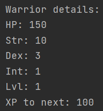
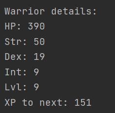
---

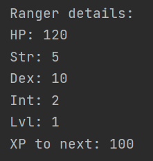
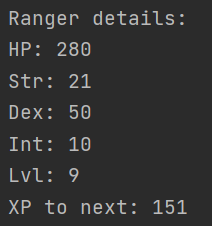
---

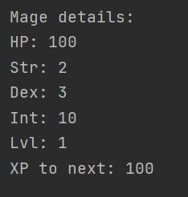
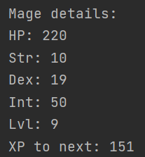
#### 3. Melee, range and magic weapon for our heroes

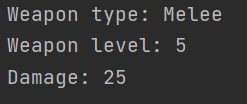
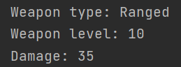
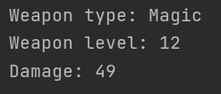

#### 4. And armors...

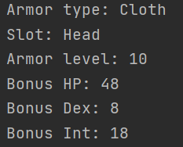

---
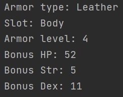

---
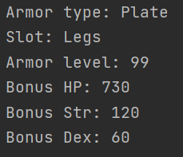

#### 5. Equipped Warrior
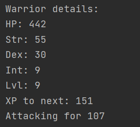

#### 6. Warrior equipped with 100 body armors
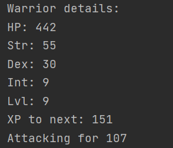

#### 7. Warrior with only sword. Added leggings level is too high for our warrior
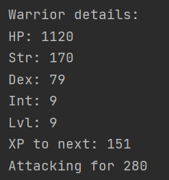

#### 8. Added leggings, so our Warrior don't get cold
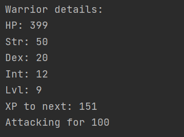

## About tests

Testing this project was not part of the description. Tests in this application covers only the basic examples given in the [task](/documents/Task3.pdf). 

First version of warrior class was build using principles of test driven development.
This led building far more tests than necessary for modelling and class design project.

## Structure
